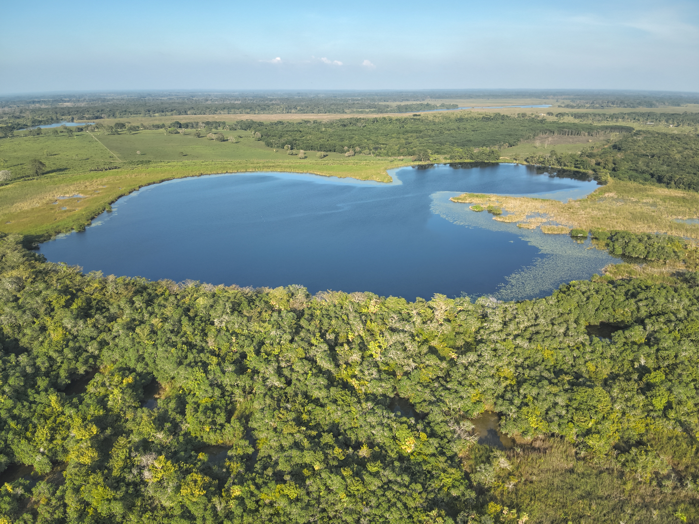
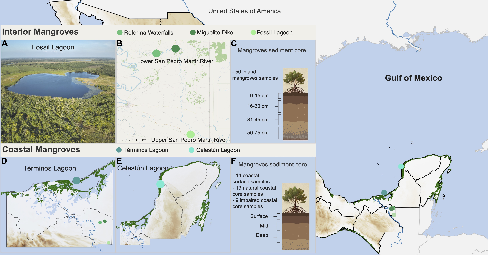

Website of microbial diversity analysis of the paper

------------------------------------------------------------------------

------------------------------------------------------------------------

Mangroves play a crucial role in ecological services like hurricane protection, carbon storage, and biodiversity support by harboring essential microbial communities for nutrient recycling and biogeochemical cycling. The microbial diversity of inland mangroves, particularly the relict mangroves of the San Pedro River from the last interglacial period, remains understudied. The study of these surviving mangrove systems offers insights into microbial dynamics and the identification of [resilient microbiota]{.underline} with potential applications in mangrove restoration efforts. By exploring similarities and differences between **coastal and inland mangroves**, as well as **degraded coastal mangroves**, we aim to **understand the unique qualities that make inland mangroves distinct while also identifying common elements shared by all mangrove ecosystems.**

In this work we studied the microbial diversity associated with *Rhizophora mangle* of inland and coastal mangroves distributed on the Yucatan platform. Inland mangroves, distributed along the San Pedro Martir river, are 170 km away from the nearest estuary. Samples were taken from Laguna El Cacahuate (Fossil Lagoon), in the upper part of the river, near Guatemala, and from the Miguelito Dike and Reforma Waterfalls in the lower part of the river, in the state of Tabasco. While for coastal mangroves, public data were taken from isolated sediments in the Términos Lagoon and the Celestún Lagoon.

------------------------------------------------------------------------

------------------------------------------------------------------------
